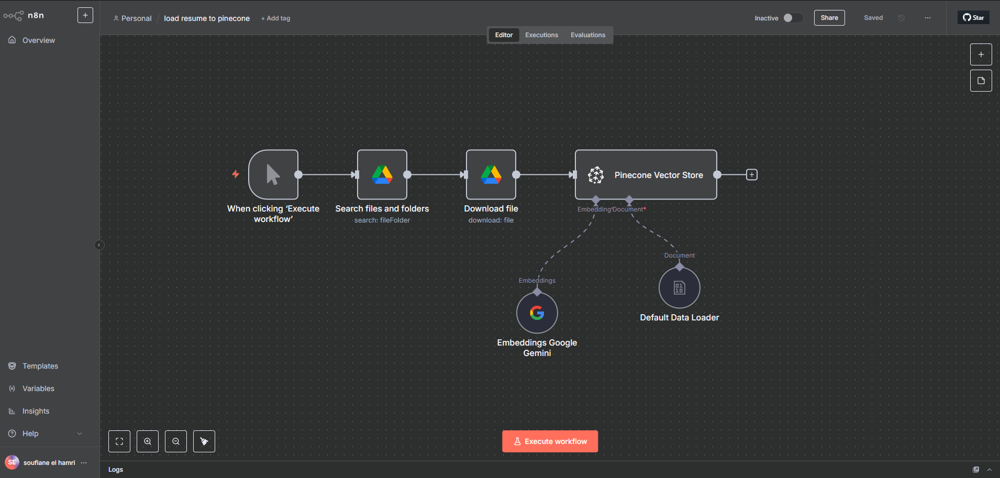

# 🧠 AI-powered Resume Matcher

An advanced automation system for matching resumes with job requirements using **n8n**, **Google Drive**, **Google Gemini**, **Pinecone**, and **Gmail**. This project enables seamless processing, indexing, querying, and response automation with zero manual effort.

---

## 📂 Table of Contents

- [Overview](#overview)
- [Screenshots](#screenshots)
- [Workflows](#workflows)
  - [Load Resume to Pinecone](#load-resume-to-pinecone)
  - [AI Powered Resume Matcher](#ai-powered-resume-matcher)
- [Prerequisites](#prerequisites)
- [Setup and Configuration](#setup-and-configuration)
- [Usage](#usage)
- [Support](#support)

---

## 🧾 Overview

This project uses **n8n workflows** to automate the end-to-end pipeline of:

- Loading resumes from Google Drive
- Generating embeddings with Google Gemini
- Indexing resumes into a Pinecone vector store
- Accepting job requirements via a form
- Matching resumes using vector similarity
- Sending candidate recommendations via Gmail

---

## 🖼️ Screenshots

### 🔹 Load Resume to Pinecone Workflow

### 🔹 AI-Powered Resume Matcher Workflow

---

2

## 🔄 Workflows

### ✅ Load Resume to Pinecone

Manually triggered workflow to index resumes from a Google Drive folder into Pinecone.

**Steps:**

- **Search files in Drive**
- **Download file**
- **Generate embeddings** with Google Gemini
- **Load to Pinecone vector store**
- **Prepare with Default Data Loader**

📄 `load resume to pinecone.json`

---

### ✅ AI Powered Resume Matcher

Triggered via a **form submission**, it matches job requirements with resumes and sends results by email.

**Steps:**

- **Form Submission** (webhook)
- **AI Agent** to process job requirements
- **Vector Store** query
- **Google Gemini Chat** for interpretation
- **Gmail** to send results

📄 `AI-powered-Resume-Matcher.json`

---

## ✅ Prerequisites

- [n8n](https://docs.n8n.io/)
- API access and credentials for:
  - Google Drive
  - Pinecone
  - Google Gemini (PaLM)
  - Gmail
- Internet access & valid API scopes

---

## ⚙️ Setup and Configuration

1. **Add API Credentials in n8n**:

   - Google Drive OAuth2
   - Pinecone API Key
   - Google Gemini API Key
   - Gmail OAuth2

2. **Import Workflows**:

   - `load resume to pinecone.json`
   - `AI-powered-Resume-Matcher.json`

3. **Edit Configuration**:
   - Update Drive folder path
   - Configure Pinecone namespace
   - Set Google Gemini model
   - Insert destination email

---

## 🚀 Usage

- **Resume Loading**:  
  Manually execute the “Load Resume to Pinecone” workflow.

- **Resume Matching**:  
  Submit job details via form → Matches resume → Sends result via Gmail.

---
